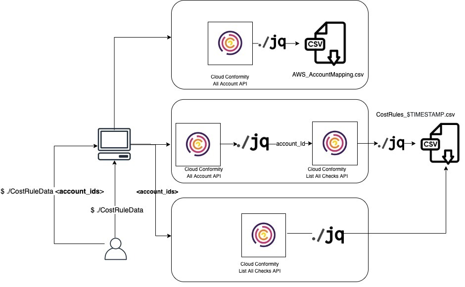

# ConformityCostRules

A script to pull cost rule data from Conformity

## Solution Design

## Usage

Make sure jq is installed on your linux/mac terminal https://stedolan.github.io/jq/

This script calls the Trend Micro Cloud One Conformity API: https://github.com/cloudconformity/documentation-api 

Run the script from the terminal. You can enter Conformity account ids as arguments to only scan those accounts.

`$ ./CostRuleData <accountIDArgument>`

If left blank, the script will pull results for all your accounts. You can also list multiple specifc accounts.
eg:

`$ ./CostRuleData`

`$ ./CostRuleData acbds2347,sdlccn287`
  
You will be asked to enter the AWS region your Conformity instance is hosted in, eg:
us-west-2

You also enter the API key for your Conformity user.

The output is a csv file.

### Credit
Tom Ryan helped test and edit v1
